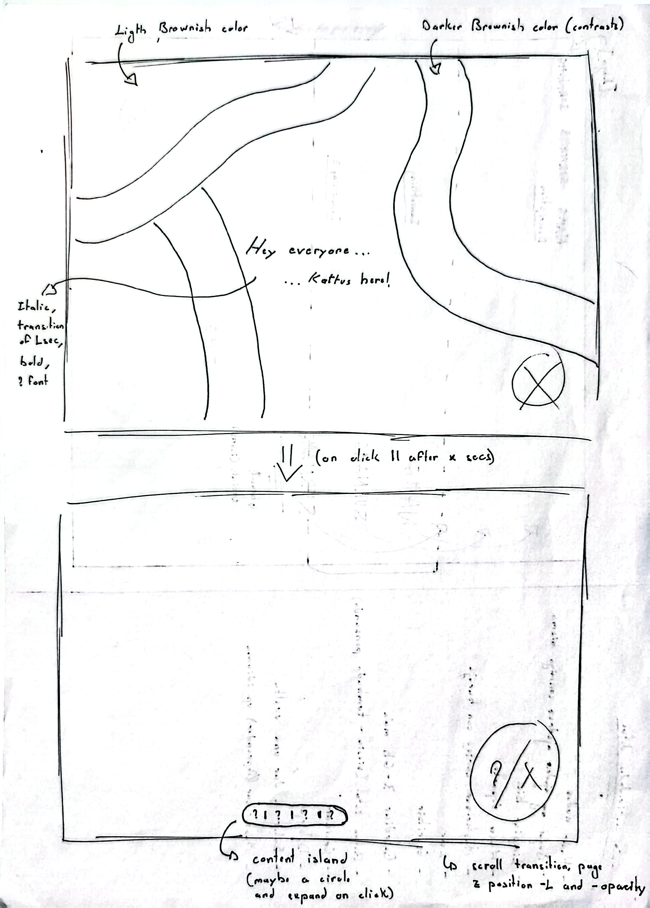
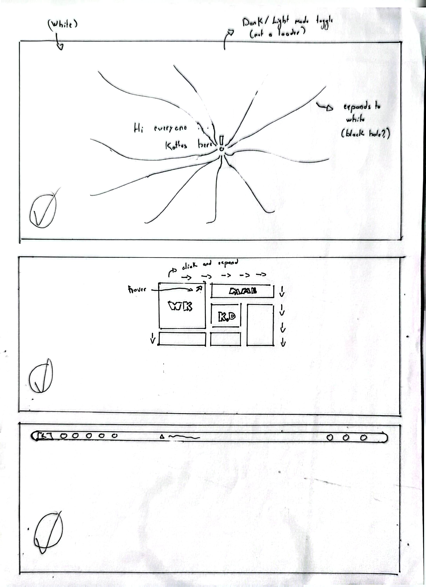
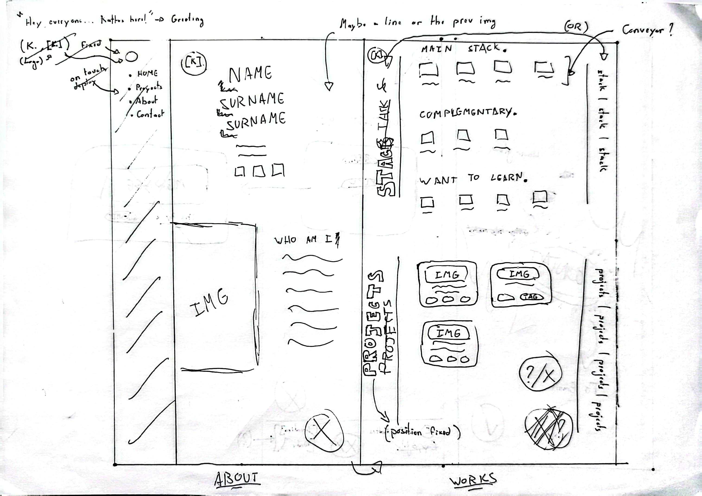
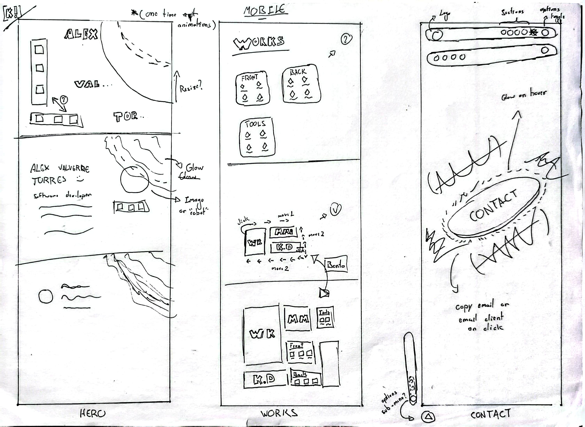

import Callout from '../../../components/Content/Callout.astro';

## Overview
Creating this page is not a new idea; I had been turning it over in my head for a while. However, I initially thought my main goal was not to learn front-end, but to continue diving deeper into Java and Spring Boot to master back-end development. That was the case until I started [MuuMe](https://kattus.dev/es/muume). When I developed a basic API for this project, I realized I couldn't leave it without a graphical interface; after all, it is practically essential nowadays for a web messaging application.

It was thanks to this necessity that I decided to pause development completely to learn front-end, aiming to give it a professional and functional aesthetic. At first, I tried to learn on my own, relying on the little I remembered from my vague attempts in the past with HTML, CSS, and JavaScript, but I didn't get very far. Then I discovered [The Odin Project (TOP)](https://www.theodinproject.com/), which, although I didn't exhaust every resource, served as a solid foundation for understanding how the entire web ecosystem actually works.

Originally, the idea wasn't to make my own portfolio, but to gain fluency with these technologies to apply them to MuuMe. But after completing a TOP activity where I had to layout a ["landing page"](https://github.com/KattusOcean/frontend-approach/tree/main/top/projects/css-projects/landing-page), I remembered that idea that had been with me for so long and told myself: "Why don't I just make my own website?". That is why I am writing this post today: to walk through the process I immersed myself in to create this, my own page.

## Design #1: Imagination takes the lead
Like every learner diving into unknown territory, I designed a first draft for my website without really gauging the technical limitations or the time needed to bring it to life.

Unaware of fundamental aspects of user experience —such as the importance of not making the visitor wait— I wanted to implement an initial loading screen. The idea was to have the message "Hello Everyone," appear, followed a second later by "Kattus here!". This phrase, which I borrowed from the intro of [SourSweet's](https://www.youtube.com/channel/UC_hzV1UIVP1yKmU_kVN3tFQ) videos, fascinates me for its musicality, brevity, and simplicity. Once the phrase finished appearing, the user would have a few seconds to interact, or the page would advance automatically. The section change consisted of a complex animation: the current page would dim slightly —as if moving into the background— and the next one would appear from below, scrolling up and "devouring" the previous one. Once the transition finished, the main content would appear alongside a floating island at the bottom acting as a navigation menu.

<figure class="text-center">

  
  <figcaption class="-mt-5">Figure 1: Welcome page</figcaption>

  
  <figcaption class="-mt-5">Figure 2: Welcome page + mock-up</figcaption>

</figure>

The technical complexity of these animations and transitions was excessive for a beginner —and to tell the truth, it still is— so I finally decided to discard the idea and opt for a much simpler approach.

## Design #2: Kaelestia.dev
After a brief analysis, I decided to draw inspiration from the aesthetic of my own operating system. On my laptop, I use [Arch Linux](https://archlinux.org/), which allows me to use a window manager like [Hyprland](https://hypr.land/). Thanks to that, I was able to use a visual customization—or "rice"—that I adopted as soon as it was posted on the [r/unixporn](https://www.reddit.com/r/unixporn/) subreddit in mid-summer 2025: [Caelestia](https://github.com/caelestia-dots/shell).

I thought: "If I use this configuration every day and love it, why not bring it to my website?". No sooner said than done. The result was a highly clean and spacious design, but I soon hit a snag: that elegance only worked well on large screens. I hadn't taken into account the headache that mobile devices represent.

<figure class="text-center">

  
  <figcaption class="-mt-5">Figure 3: Multiple general ideas pt1</figcaption>

  
  <figcaption class="-mt-5">Figure 4: Multiple general ideas pt2</figcaption>

</figure>

<Callout type="faq" title="Does this design belong to Caelestia?">
  

    Yes, although the most characteristic part of the design —the sidebar— was removed. During these sketches, I experimented with different ways to replace it, and for the sake of speed in creating more sketches (since I'm not including all of them in this post), I didn't draw the window, only the content.
    

</Callout>

## The *mobile-first* philosophy
Although I had heard of the *mobile-first* philosophy, I didn't keep it in mind at the time. This approach is a standard in web development for a simple reason: it is much easier to scale elements of an interface upward than to try to compress them when they are already designed for large resolutions.

When I first implemented my Caelestia-based design on a mobile screen, the result wasn't terrible, but I felt like I was lacking space. For the aesthetic to remain faithful to the original, it required wide margins, a sidebar taskbar, and a content window that, together, saturated the visible area. Although the idea doesn't seem misguided today, looking back, I recognize that it wasted too much space; trying to make use of it would have meant sacrificing the readability of the content.

<figure class="text-center">

  
  <figcaption class="-mt-5">Figure 5: Caelestia web - mobile version</figcaption>

</figure>

Following this experience, I always try to apply *mobile-first* design. However, this creates a personal conflict for me: for some reason, I am never satisfied with how web designs look on mobile devices, which leads me to discard ideas that, in another context, could have been very good.

## Design #3: Exploring the Bento style
After exploring multiple sources of inspiration —from YouTube channels like [MiduDev](https://www.youtube.com/c/midudev) to platforms like [Awwwards](https://www.awwwards.com/) or [BentoGrids](https://bentogrids.com/)— I decided to simplify my approach: I opted to design an interactive Bento. I also checked [Godly](https://godly.website), although it has recently changed course, transforming both its aesthetic and its catalog, moving away from that inexhaustible source of portfolios I found at the beginning of my search.

My idea was for the page to be composed entirely of a Bento-style design. Upon interacting with any of the blocks, it would expand, "devouring" the others to occupy the central space and show its content. It was a brilliant solution to reduce visual clutter and concentrate information, but, like a good beginner, I hit a technical wall: I didn't master [TailwindCSS]() or design concepts like *flexbox* or *grid*.

<figure class="text-center">

  
  <figcaption class="-mt-5">Figure 6: Bento interactivity</figcaption>

</figure>

<Callout type="note" title="Note">
  
The sketches crossing the page are not part of the design.

</Callout>

<figure class="text-center">

  
  <figcaption class="-mt-5">Figure 7: Inside the Bento blocks</figcaption>

</figure>

## Design #4: Recreating to learn
After all this learning, I decided to build my portfolio taking the design of [Jessica](https://jestsee.com) as a reference. Its aesthetic fascinated me, but upon analyzing it, I realized it used structures that, for my technical level, were too complex to replicate exactly.

Far from looking for a shortcut, I saw a learning opportunity: I decided to rebuild the design from scratch. Instead of cloning its architecture, I set out to recreate its visual essence using my own logic and my own tools ([Astro](https://astro.build/) and [TailwindCSS](https://tailwindcss.com/)). This process was an immense technical challenge. I had to figure out how to achieve that visual harmony, the choice of color palette, and the rhythm of the animations, discovering along the way that having the visual acuity to combine elements so well is, truly, an art.

Once the technical phase was overcome, all that remained was what I thought would be "the easy part": replacing the placeholders with my own text. However, this was, without a doubt, the most complex task and the one I have been putting off the most. Choosing what to say and how to say it requires total concentration, especially when facing the drafting of project descriptions and blog posts like this one. Writing about what you do, with your own voice and without relying on an empty design placeholder, is, once again, an art.

## Styling with TailwindCSS
[TailwindCSS](https://tailwindcss.com/) is one of those tools that every front-end developer eventually comes across. It is simply fantastic. Although there is no shortage of critics regarding the obfuscation generated by the excess of classes in HTML, the ability to apply complex styles in a single line is impressive. Not to mention the agility it provides by eliminating the need to navigate through endless CSS files in search of a specific selector; I perfectly understand why it is the standard in the vast majority of modern projects.

However, it is not a tool without a learning curve. I don't know if it's because of its vast range of customization options or the natural complexity of laying out responsive elements that maintain aesthetic harmony, but Tailwind is not exactly trivial. We aren't talking about difficulty on the level of low-level languages, by any means, but it is a tool so flexible and dense that the feeling of "mastering" it only comes after many hours of trial and error, playing with every possible combination.

## The Astro essence: Content Collections and dynamic routes
[Astro](https://astro.build/) has been the fundamental pillar of this project. Although it was born as a framework optimized for static sites, its evolution has been brilliant; today, through its "islands" architecture, it allows injecting dynamism only where it is really necessary. Its greatest asset is, without a doubt, its *zero-JS* philosophy: by default, Astro sends zero lines of JavaScript to the browser, which guarantees exceptional performance from the first second.

Beyond speed, what really captivated me was how it handles content. By working natively with [Markdown](https://daringfireball.net/projects/markdown/) (and in my case, with [MDX](https://mdxjs.com/)), the writing experience is impeccable. For a portfolio where project posts and the blog are key pieces, Astro's *Content Collections* have been a lifesaver: they have allowed me to validate my content with *Zod* and structure everything in a typed way, avoiding common errors and facilitating long-term maintenance.

<figure class="text-center">

  
  <figcaption class="-mt-5">Figure 8: Astro structure</figcaption>

</figure>

Furthermore, the development experience is outstanding. Being able to manage dependencies directly from the terminal with its own command is an indescribable convenience, and its optimization capability is worth mentioning; for example, the `<Image/>` component is capable of automatically transforming PNG or JPG files, among others, to more modern formats like WebP, drastically reducing the weight without me having to worry about complex manual processes.

This same page is an example: what you are reading resides in an MDX file, processed efficiently so that loading is instantaneous. Thanks to all this, I consider Astro not only an excellent option but probably the current gold standard for developing any site where speed and user experience are the priority.

## What now?
Now that my portfolio is fully functional and has the aesthetic I was looking for, I can finally return to what started it all: the development of [MuuMe](https://kattus.dev/es/projects/muume). I do so with the peace of mind of knowing that my projects will not only be robust at a logical level, but that they will now also offer a polished and pleasant user experience.

Even so, this is not a final stop. This page is a living organism that will evolve; it is very likely that, as I continue to deepen my knowledge of new technologies, I will consider a redesign next year to integrate everything I've learned and continue polishing my own digital identity.