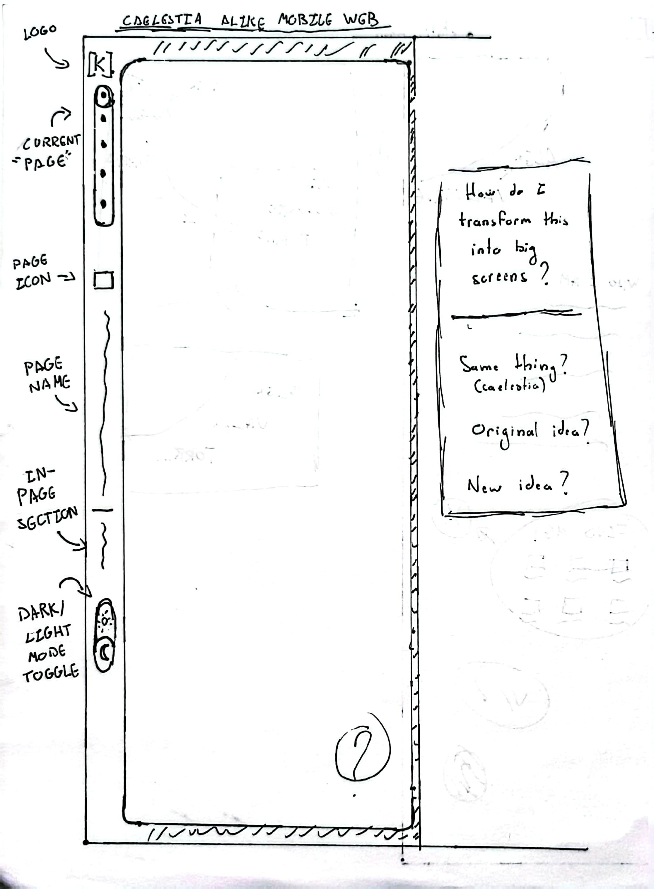
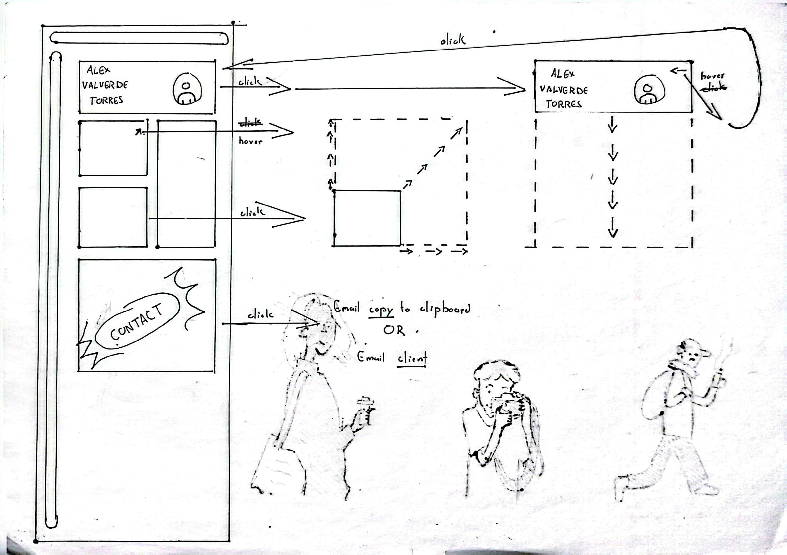
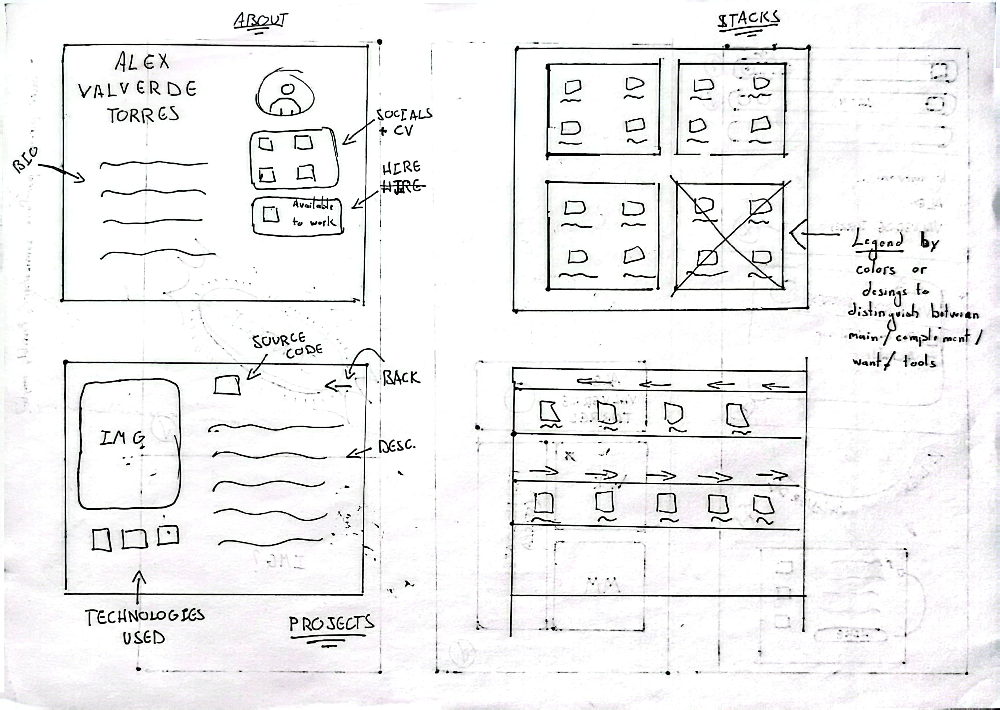
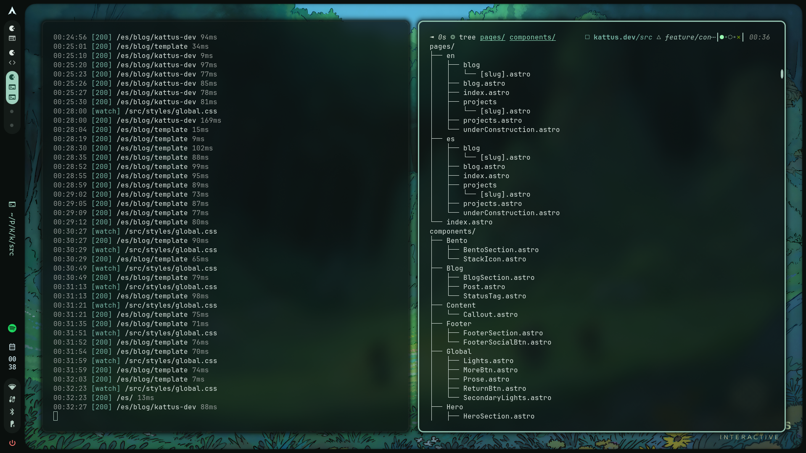

import Callout from '../../../components/Content/Callout.astro';

## Descripción general
La creación de esta página no es algo nuevo, ya llevaba tiempo dándole vueltas. Sin embargo, pensaba que mi objetivo principal no era aprender front-end, sino seguir profundizando en Java y Spring Boot para dominar el back-end. Eso fue así hasta que empecé con [MuuMe](https://kattus.dev/es/muume). Cuando desarrollé una API básica para este proyecto, me di cuenta de que no podía dejarlo sin interfaz gráfica: al fin y al cabo, es prácticamente imprescindible hoy en día para una aplicación de mensajería web.

Fue gracias a esta necesidad que decidí pausar por completo el desarrollo para aprender front-end y así darle una estética profesional y funcional. Al principio intenté aprender por mi cuenta, tirando de lo poco que recordaba de mis vagos intentos del pasado con HTML, CSS y JavaScript, pero no llegué muy lejos. Después descubrí [The Odin Project (TOP)](https://www.theodinproject.com/), que, aunque no lo exprimí, me sirvió como una base sólida para entender cómo funciona realmente todo el ecosistema web.

Originalmente, la idea no era hacer mi propio portafolio, sino ganar soltura con estas tecnologías para aplicarlas en MuuMe. Pero, tras realizar una actividad de TOP en la que tuve que maquetar una ["landing page"](https://github.com/KattusOcean/frontend-approach/tree/main/top/projects/css-projects/landing-page), recordé aquella idea que llevaba tanto tiempo conmigo y me dije: "¿Y por qué no hago mi propia web?". Es por eso que hoy estoy escribiendo este post: para recorrer el proceso en el que me sumergí para crear lo que es esta, mi propia página.

## Diseño nº1: Imaginación al poder
Como todo aprendiz que se lanza a un terreno desconocido, diseñé un primer boceto para mi página web sin medir realmente las limitaciones técnicas ni el tiempo necesario para materializarlo.

Al desconocer aspectos fundamentales de la experiencia de usuario —como la importancia de no hacer esperar al visitante—, quise implementar una pantalla de carga inicial. La idea era que apareciera el mensaje *"Hello Everyone,"* seguido un segundo después por *"Kattus here!"*. Esta frase, que tomo prestada del inicio de los vídeos de [SourSweet](https://www.youtube.com/channel/UC_hzV1UIVP1yKmU_kVN3tFQ), me fascina por su musicalidad, brevedad y sencillez. Una vez que la frase terminaba de aparecer, el usuario tendría unos segundos para interactuar o, de lo contrario, la página avanzaría automáticamente. El cambio de sección consistía en una animación compleja: la página actual se oscurecía ligeramente —como pasando a un segundo plano— y la siguiente aparecía desde abajo, desplazándose hacia arriba y "devorando" a la anterior. Una vez finalizada la transición, aparecería el contenido principal junto a una isla flotante inferior que actuaría como menú de navegación.

<figure class="text-center">

  
  <figcaption class="-mt-5">Figura 1: Página de bienvenida</figcaption>

  
  <figcaption class="-mt-5">Figura 2: Conceptos de las páginas iniciales</figcaption>

</figure>

La complejidad técnica de estas animaciones y transiciones era excesiva para un principiante —y, a decir verdad, aún lo sigue siendo—, por lo que finalmente decidí descartar la idea y optar por un enfoque mucho más sencillo.

## Diseño nº2: Kaelestia.dev
Tras un momento de lucidez, decidí inspirarme en la estética de mi propio sistema operativo. En mi portátil utilizo [Arch Linux](https://archlinux.org/), lo que me permite usar un gestor de ventanas como [Hyprland](https://hypr.land/). Gracias a ello, pude usar una personalización visual —o rice— que adopté nada más publicarse en el subreddit [r/unixporn](https://www.reddit.com/r/unixporn/) a mediados del verano de 2025: [Caelestia](https://github.com/caelestia-dots/shell).

Pensé: "Si uso esta configuración todos los días y me encanta, ¿por qué no llevarla a mi página web?". Dicho y hecho. El resultado fue un diseño sumamente limpio y espacioso, pero pronto me topé con un inconveniente: esa elegancia solo funcionaba bien en pantallas grandes. No había tenido en cuenta el dolor de cabeza que suponían los dispositivos móviles.

<figure class="text-center">

  
  <figcaption class="-mt-5">Figura 3: Conceptos para el diseño Caelestia</figcaption>

  
  <figcaption class="-mt-5">Figura 4: Más conceptos para el diseño Caelestia</figcaption>

</figure>

<Callout type="faq" title="¿Este diseño pertenece a caelestia?">
  

    Sí, aunque se eliminó lo más caracterítico del diseño, la barra lateral, durante estos bocetos experimenté con difrentes formas de sustituirla y por rápidez para hacer más bocetos —ya que todos no los incluyo en este post—, no dibujé la ventana, solo el contenido.
    

</Callout>

## La filosofía *mobile-first*
Aunque ya había oído hablar de la filosofía *mobile-first*, en aquel momento no la tuve presente. Este enfoque es un estándar en el desarrollo web por una razón sencilla: resulta mucho más fácil escalar elementos de una interfaz que intentar comprimirlos cuando ya están diseñados para grandes resoluciones.

Cuando implementé por primera vez mi diseño basado en Caelestia en una pantalla móvil, el resultado no era terrible, pero sentía que me faltaba espacio. Para que la estética se mantuviera fiel al original, requería márgenes amplios, una barra de tareas lateral y una ventana de contenido que, en conjunto, saturaban el área visible. Aunque la idea no me parece desacertada hoy en día, al analizarla en retrospectiva, reconozco que desperdiciaba demasiado espacio; intentar aprovecharlo hubiera significado sacrificar la legibilidad del contenido.

<figure class="text-center">

  
  <figcaption class="-mt-5">Figura 5: Diseño Caelestia, versión móvil</figcaption>

</figure>

A raíz de esta experiencia, siempre intento aplicar el diseño *mobile-first*. No obstante, esto me genera un conflicto personal: por algún motivo, nunca termino de estar satisfecho con cómo lucen los diseños web en dispositivos móviles, lo que me lleva a descartar ideas que, en otro contexto, podrían haber sido muy buenas.

## Diseño nº3: Explorando el estilo Bento
Tras explorar múltiples fuentes de inspiración —desde canales de YouTube como [MiduDev](https://www.youtube.com/c/midudev), hasta plataformas como [Awwwards](https://www.awwwards.com/) o [BentoGrids](https://bentogrids.com/)—, decidí simplificar mi enfoque: opté por diseñar un Bento interactivo. También consulté [Godly](https://godly.website), aunque recientemente ha cambiado de rumbo y ha transformado tanto su estética como su catálogo, alejándose de aquella fuente inagotable de portafolios que encontré al principio de mi búsqueda.

Mi idea era que la página se compusiera íntegramente por un diseño tipo Bento. Al interactuar con cualquiera de los bloques, este debía expandirse, "devorando" al resto para ocupar el espacio central y mostrar su contenido. Era una solución estupenda para reducir el desorden visual y concentrar la información, pero, como buen principiante, me encontré con un muro técnico: no dominaba [TailwindCSS]() ni conceptos de diseño como *flexbox* o *grid*.

<figure class="text-center">

  
  <figcaption class="-mt-5">Figura 6: Interactividad del diseño Bento</figcaption>

</figure>

<Callout type="note" title="Nota">
  
Los dibujos que atraviesan el folio no son parte del diseño.

</Callout>

<figure class="text-center">

  
  <figcaption class="-mt-5">Figura 7: Dentro de los bloques Bento</figcaption>

</figure>

## Diseño nº4: Recrear para aprender
Tras todo este aprendizaje, decidí construir mi portafolio tomando como referencia el diseño de [Jessica](https://jestsee.com). Su estética me fascinó, pero al analizarla, me di cuenta de que utilizaba estructuras que, para mi nivel técnico, resultaban demasiado complejas de replicar exactamente.

Lejos de buscar un atajo, vi una oportunidad de aprendizaje: decidí reconstruir el diseño desde cero. En lugar de clonar su arquitectura, me propuse recrear su esencia visual utilizando mi propia lógica y mis herramientas ([Astro](https://astro.build/) y [TailwindCSS](https://tailwindcss.com/)). Este proceso fue un desafío técnico inmenso. Tuve que ingeniármelas para lograr esa armonía visual, la elección de la paleta de colores y el ritmo de las animaciones, descubriendo en el camino que tener la agudeza visual para combinar elementos tan bien es, realmente, un arte.

Una vez superada la fase técnica, solo quedaba lo que pensé que sería "la parte fácil": reemplazar los "placeholders" por textos propios. Sin embargo, esta fue, sin duda, la tarea más compleja y la que más he ido posponiendo. Elegir qué decir y cómo decirlo requiere total concentración, especialmente al enfrentarme a la redacción de descripciones de proyectos y a entradas de blog como esta. Escribir sobre lo que haces, con tu propia voz, es, de nuevo, un arte.

## Estilos con TailwindCSS
[TailwindCSS](https://tailwindcss.com/) es una de esas herramientas que, tarde o temprano, todo desarrollador front-end acaba encontrando en su camino. Es, sencillamente, fantástica. Aunque no faltan voces críticas respecto a la ofuscación que genera el exceso de clases en el HTML, la capacidad de aplicar estilos complejos en una sola línea es impresionante. Por no hablar de la agilidad que aporta al eliminar la necesidad de navegar entre archivos CSS interminables en busca de un selector específico; entiendo perfectamente por qué es el estándar en la inmensa mayoría de los proyectos modernos.

Ahora bien, no es una herramienta exenta de curva de aprendizaje. No sé si por su extenso abanico de opciones de personalización o por la complejidad natural de maquetar elementos responsive que mantengan una armonía estética, Tailwind no es precisamente trivial. No hablamos de una dificultad al nivel de lenguajes de bajo nivel, ni mucho menos, pero sí de una herramienta tan flexible y densa que la sensación de "dominarla" solo llega después de muchas horas de ensayo y error, jugando con cada combinación posible.

## La esencia Astro: Colecciones de contenido y rutas dinámicas
[Astro](https://astro.build/) ha sido el pilar fundamental de este proyecto. Aunque nació como un framework optimizado para sitios estáticos, su evolución ha sido digna de estudio. Hoy en día, mediante su arquitectura de "islas", permite inyectar dinamismo solo donde realmente es necesario. Su mayor baza es, sin duda, su filosofía *"zero-JS"*: por defecto, Astro envía cero líneas de JavaScript al navegador, lo que garantiza un rendimiento excepcional desde el primer segundo.

Más allá de la velocidad, lo que realmente me cautivó fue cómo maneja el contenido. Al trabajar de forma nativa con [Markdown](https://daringfireball.net/projects/markdown/) —y en mi caso, con [MDX](https://mdxjs.com/)—, la experiencia de redacción es impecable. Para un portafolio donde los posts de proyectos y el blog son piezas clave, las Content Collections de Astro han sido un salvavidas: me han permitido validar mi contenido con Zod y estructurar todo de forma tipada, evitando errores comunes y facilitando el mantenimiento a largo plazo.

<figure class="text-center">

  
  <figcaption class="-mt-5">Figura 8: Estructura Astro</figcaption>

</figure>

Además, la experiencia de desarrollo es sobresaliente. Poder gestionar dependencias directamente desde la terminal con su propio comando es una comodidad indescriptible, y su capacidad de optimización es digna de mención; por ejemplo, el componente `<Image/>` es capaz de transformar automáticamente archivos PNG o JPG, entre otros a formatos más modernos como WebP, reduciendo drásticamente el peso sin que tenga que preocuparme por procesos manuales complejos.

Esta misma página es un ejemplo: lo que estás leyendo reside en un archivo MDX, procesado de forma eficiente para que la carga sea instantánea. Gracias a todo esto, considero que Astro no es solo una opción excelente, sino probablemente el estándar de oro actual para desarrollar cualquier sitio donde la velocidad y la experiencia de usuario sean la prioridad.

## ¿Y ahora qué?
Ahora que mi portafolio es plenamente funcional y cuenta con la estética que buscaba, finalmente puedo volver a aquello que lo inició todo: el desarrollo de [MuuMe](https://kattus.dev/es/projects/muume). Lo hago con la tranquilidad de saber que mis proyectos no solo serán robustos a nivel lógico, sino que ahora también ofrecerán una experiencia visual cuidada y agradable para el usuario.

Aun así, esto no es un punto final. Esta página es un organismo vivo que irá evolucionando; es muy probable que, conforme siga profundizando en nuevas tecnologías, me plantee un rediseño el año que viene para integrar todo lo aprendido y seguir puliendo mi propia identidad digital.