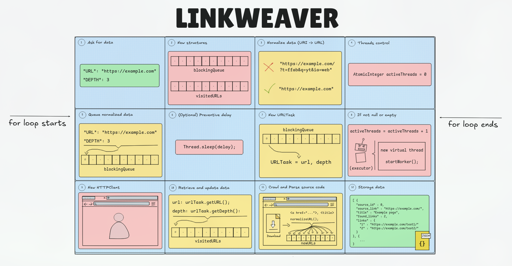

## Overview
In mid-April 2026, I remembered the project for a new browser that some dubbed the "Google Chrome Killer" ([Ladybird](https://ladybird.org/)). What started as a memory led me to look into how browsers are developed and to answer a question: "How hard is it to build a search engine from scratch?". After some research, I identified 7 pillars necessary to create a search engine that, while not intended to compete with Google Chrome, would be capable of delivering useful results. These 7 needs are:

- **Crawler:** Downloads the source code of pages.
- **Parser:** Extracts links by looking for `<a>` elements.
- **Indexer:** Organizes data for efficient searching.
- **Database:** Stores information for fast queries.
- **Query Engine:** Processes the user's request.
- **Relevance Engine:** Ranks the importance of results.
- **Frontend:** Access interface for the end-user.

Beyond the functional challenge, this project was born with a clear technical goal: to master multithreading in Java, a key point in my [learning roadmap](https://roadmap.sh/java).

Currently, the project is in the phase of indexing data for more efficient searches, and my goal is to evolve this prototype into a functional search engine capable of real-world indexing.

## Multithreading?
At first, I underestimated the complexity surrounding concurrency, but thanks to [Jakob Jenkov's resources](https://jenkov.com/tutorials/java-concurrency/index.html), I managed to grasp the theory. However, moving from theory to implementing threads was a huge leap, so I had to plan an incremental development strategy:

- **Sequential Prototype:** I first built the project without concurrency to ensure the logic for parsing, indexing, and storage worked correctly.

- **Testing Lab:** Before bringing concurrency to LinkWeaver, I created [small, isolated projects](https://github.com/KattusOcean/java-review-old/tree/main/mini-projects/concurrency) (like a simulation of simultaneous ATMs) which allowed me to understand critical concepts like thread safety, race conditions, and lock management.

- **Real Implementation:** Once I mastered the concepts, I began integrating threads into the Crawler, allowing page downloads to happen in parallel instead of blocking the main thread.

<figure class="text-center">

  
  <figcaption class="-mt-5">Figure 1: Flowchart of the concurrent indexing process.</figcaption>

</figure>

## Implementing the HTTP Client
To interact with the web, I used Java's native `HttpClient` API. A key detail was configuring the `User-Agent`. Many servers block generic-looking requests; identifying myself as a specific crawler helps me stay transparent and avoid unnecessary blocks. Another key adjustment was using `Redirect.ALWAYS`, as it prevents the crawler from getting lost and allows it to advance to the next page.

```java
  /* ===== HTTP Client ===== */
  this.httpClient = HttpClient.newBuilder()
    .followRedirects(HttpClient.Redirect.ALWAYS)
    .connectTimeout(Duration.ofSeconds(5))
    .build();

  /* ===== HTTP Request and Response ===== */
  try {
    HttpRequest httpRequest = HttpRequest.newBuilder()
      .uri(URI.create(pageURL))
      .header("User-Agent", "EasyCrawler/1.0") 
      .timeout(Duration.ofSeconds(30))
      .GET()
      .build();

      HttpResponse<String> httpResponse = httpClient.send(httpRequest, 
      HttpResponse.BodyHandlers.ofString());
      return httpResponse.body();

  } catch (IOException | InterruptedException e) {
      throw new RuntimeException(e);
  }
```

Thanks to this implementation, the crawler can handle redirects automatically and respect server response times, ensuring robust communication.

## Analyzing Wikipedia: The challenge of real data
To test LinkWeaver's efficiency, I used Wikipedia as my main dataset. Its massive and varied link structure is perfect for pushing any search engine to its limits. This process wasn't easy, and I faced two key technical challenges:

- **Concurrency and persistence:** When implementing multithreading, I ran into race conditions where the resulting JSON file was constantly being overwritten. I learned to manage data writing using Jackson, which allowed me to handle the output object in a safe and structured way.

- **Link Cleaning:** I discovered that many of the resources found weren't valid URLs, but relative paths that led nowhere. After checking the documentation, I found the solution was much simpler than I thought: using Jsoup's `absUrl()` method. This small tweak resolved the data integrity issue that had taken me hours of debugging.

## Optimizing performance: The power of Virtual Threads
As one might imagine, sequential crawling—downloading code, parsing it, and storing data recursively until the target depth is reached—is an I/O-intensive task. Executing this on a single thread was a critical bottleneck: the process was slow and didn't take advantage of system resources.

To solve this, I integrated Java's Virtual Threads (introduced in recent JVM releases). Although the theory behind concurrency is complex, the reward was immediate:

- **Sequential results:** 74 - 83 seconds.
- **Results with Virtual Threads:** ~7 seconds.

This reduction of almost 90% in execution time on my own site ([kattus.dev](https://kattus.dev/), depth 4) perfectly validates the multithreaded architecture I implemented. Additionally, to ensure ethical behavior and avoid being blocked by anti-bot protocols, I added a preventive delay function that simulates a natural waiting time of between 500 and 3000ms between requests.

## The Horizon of LinkWeaver
At this point, LinkWeaver has stopped being an experiment and has become a functional crawling and analysis architecture. But this is just the beginning. The search engine I set out to build is still in active development, and my roadmap for the coming months is very clear: moving from simply "collecting" links to making that information truly useful.

Right now, I am deep into developing the **Indexer** and the **Database**. The challenge here is not just storing data, but structuring it so that when I need to perform a search, the result is instantaneous. After this, I will implement the **Query Engine** and the **Relevance Engine**, which are basically the brain of the search engine so that when you search for something, you don't get just anything, but what truly matters.

There is still a long way to go until I reach the **Frontend**, but building a search engine from scratch is teaching me how the web works "under the hood" like nothing else could. Beyond the project working, the best part is what I'm learning in the process.

All development will remain public on GitHub. I will be posting updates here or writing new posts about my progress. Any help or suggestions you have are more than welcome. Thanks a lot for reading!